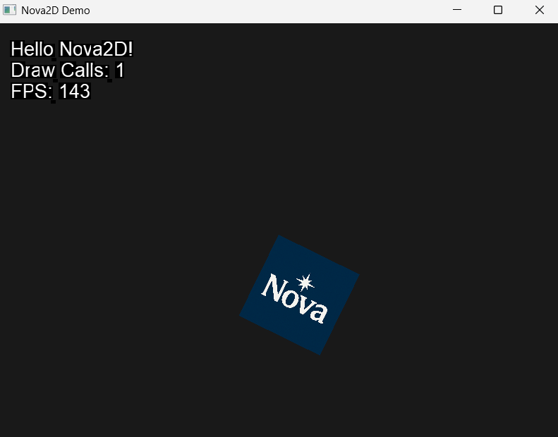

# Nova2D

**English | [中文说明在下方](#nova2d-中文说明)**

Nova2D is a lightweight 2D graphics engine written in C# (.NET 9) using OpenGL via Silk.NET.  
It provides a minimal, low-level rendering foundation without the overhead of a full game engine, making it suitable for custom engines, tools, or embedded 2D applications.

This project is in early development and includes core rendering functionality such as texture loading, sprite rendering, batching, and bitmap font support.

---

## Features

- 2D rendering via OpenGL (Silk.NET 2.22.0)
- Texture loading with stb_image
- Sprite rendering with transform and origin support
- SpriteBatch2D with multi-texture grouping
- Bitmap font rendering system (.fnt + .png)
- Real-time debug overlay (DrawCall, FPS)
- ECS-based architecture (Entity-Component-System)
- Clean and modern C# codebase (with `unsafe` support for performance)

---

## Demo



---

## Requirements

- [.NET 9.0 SDK (preview)](https://dotnet.microsoft.com/en-us/download/dotnet/9.0)

---

## Getting Started

```bash
git clone https://github.com/esengine/Nova2D.git
cd Nova2D
dotnet run --project Nova2D.Demo
```

---

## Roadmap

- [x] SpriteRenderer and SpriteBatch2D
- [x] Smart batching system (multi-texture support)
- [x] Bitmap font renderer
- [x] Debug overlay: FPS and DrawCall stats
- [ ] Input system
- [ ] UI components (Label, Button, Panel)
- [ ] Scene serialization and loading
- [ ] Audio system integration

---

# Nova2D 中文说明

Nova2D 是一个使用 C# (.NET 9) 编写的轻量级 2D 图形引擎，基于 Silk.NET 提供的 OpenGL 封装。  
项目目标是提供一个极简、可拓展的 2D 渲染基础，适合构建定制化游戏引擎、工具链或嵌入式可视化应用。

该项目当前处于早期开发阶段，已支持基本渲染能力，包括纹理加载、精灵渲染、批处理绘制和位图字体系统。

---

## 特性

- 基于 OpenGL 的 2D 渲染（Silk.NET 2.22.0）
- 使用 stb_image 加载纹理
- 支持平移、缩放、旋转、锚点的 Sprite 渲染
- SpriteBatch2D 支持自动按纹理分组批处理
- 支持 BMFont 格式的位图字体（.fnt + .png）
- 内置 Debug Overlay（实时显示 DrawCall、FPS）
- 简洁的 ECS 架构（Entity-Component-System）
- 使用 `unsafe` 提升性能，代码结构现代、清晰

---

## 示例截图


---

## 运行要求

- [.NET 9.0 SDK (预览版)](https://dotnet.microsoft.com/en-us/download/dotnet/9.0)

---

## 快速开始

```bash
git clone https://github.com/esengine/Nova2D.git
cd Nova2D
dotnet run --project Nova2D.Demo
```

---

## 开发计划

- [x] 基础 ECS 系统
- [x] Sprite 渲染与批处理系统
- [x] 位图字体渲染支持
- [x] DebugOverlay 实时调试显示
- [ ] 输入系统
- [ ] 基础 UI 系统（标签、按钮）
- [ ] 场景序列化 / 加载支持
- [ ] 音频系统集成
